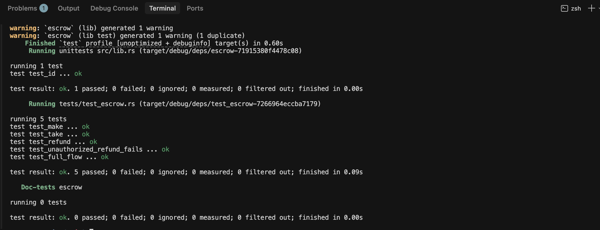

# escrow-sol-turbin3-

A simple Solana escrow program built with Anchor 1.0. This program lets someone lock up SOL and specify what they want in return. Another person can then complete the trade.

## What This Program Does

The escrow has three instructions:

1. **Make** - Person A creates an escrow and deposits SOL into it. They specify how much they want in return.

2. **Refund** - Person A can cancel the escrow and get their SOL back.

3. **Take** - Person B completes the trade by sending the requested SOL to Person A. Person B receives the escrowed SOL in return.

## How It Works

When someone calls Make, we create two accounts:
- `escrow` - Stores the trade details (who made it, how much they want, etc.)
- `vault` - Holds the deposited SOL

Both are PDAs (Program Derived Addresses) so their addresses are predictable. The vault is a separate account from the escrow so the data and the money stay separate.

## Tech Stack

- Anchor 1.0.2
- Rust
- LiteSVM for testing

## Project Structure

```
escrow/
├── programs/escrow/src/
│   ├── lib.rs                    # Main program
│   ├── instructions/
│   │   ├── make.rs               # Create escrow
│   │   ├── refund.rs             # Cancel and get money back
│   │   └── take.rs               # Complete the trade
│   ├── state.rs                  # Escrow data structure
│   ├── constants.rs              # Seed strings
│   └── instructions.rs           # Module exports
├── programs/escrow/tests/
│   └── test_escrow.rs            # All tests
├── Anchor.toml
├── Cargo.toml
└── README.md
```

## How to Build

Make sure you have Rust, Solana CLI, and Anchor installed.

```bash
anchor build
```

This compiles the program and puts the output in `target/deploy/escrow.so`.

## How to Test

Tests are written in Rust using LiteSVM, which is a fast simulator that runs the Solana runtime on your machine without needing a validator.

```bash
cargo test
```

You should see all 5 tests pass:

```
running 5 tests
test test_make ... ok
test test_refund ... ok
test test_take ... ok
test test_unauthorized_refund_fails ... ok
test test_full_flow ... ok

test result: ok. 5 passed; 0 failed
```

Screenshot of passing tests:



## What The Tests Cover

| Test | What it checks |
|------|---------------|
| test_make | Escrow and vault get created, SOL is deposited |
| test_refund | Maker gets their SOL back, escrow closes |
| test_take | Taker sends SOL to maker, receives escrowed SOL |
| test_unauthorized_refund_fails | Only the maker can refund |
| test_full_flow | Complete workflow from make to take |

## Design Notes

**Make** uses a CPI to the System Program to transfer SOL from the maker to the vault. This works because the maker is a normal wallet account.

**Refund and Take** use direct lamport manipulation instead of CPI because the vault is a program-owned PDA with data. The System Program cannot transfer FROM an account that carries data, so our program directly adjusts the balances since it owns the vault.

**Authority check** is enforced by Anchor's `has_one = maker` constraint on refund, and by PDA seed validation on both refund and take.

**Close** - Both refund and take use `close = maker` on the escrow account. This sends the rent lamports back to the maker and deletes the account.

## Security

- Only the maker can refund their escrow
- PDA seeds are validated on every instruction
- All state changes require a transaction signer
- The escrow account is deleted after refund or take

## License

MIT
